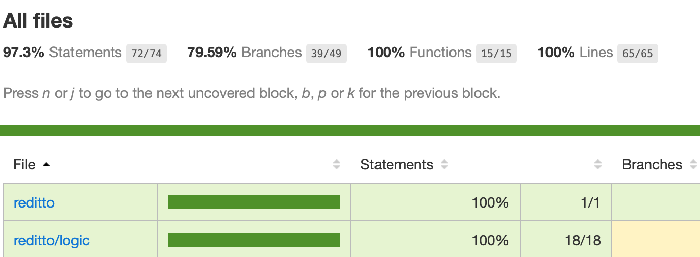

# Reditto

Reditto allows users to sort reddit posts by several categories and permits access to the original reddit post when tapping on a diaplayed post.

Categories are organized by last (based on most recent creating date), top (based on highest scored posts), polemical (most commented) and older.

Info for the posts taken from: https://api.reddit.com/r/pics/new.json

Build with React Native CLI

## Code coverage

Jest was used for testing.

## Demo

## Trello

[Redditto trello](https://trello.com/b/NML1S0Hy/mitto-reddit)
